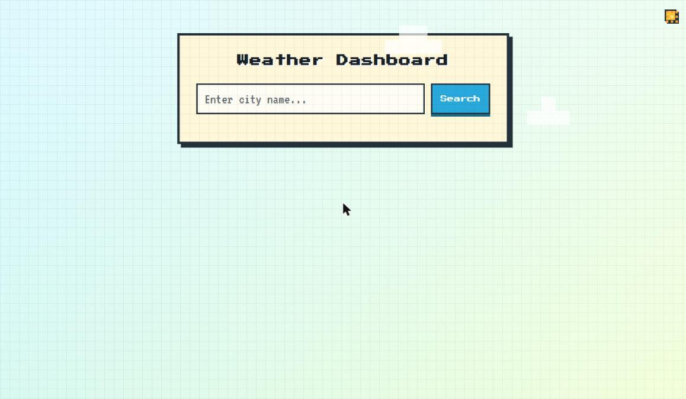
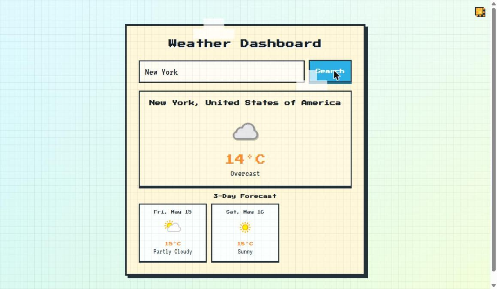
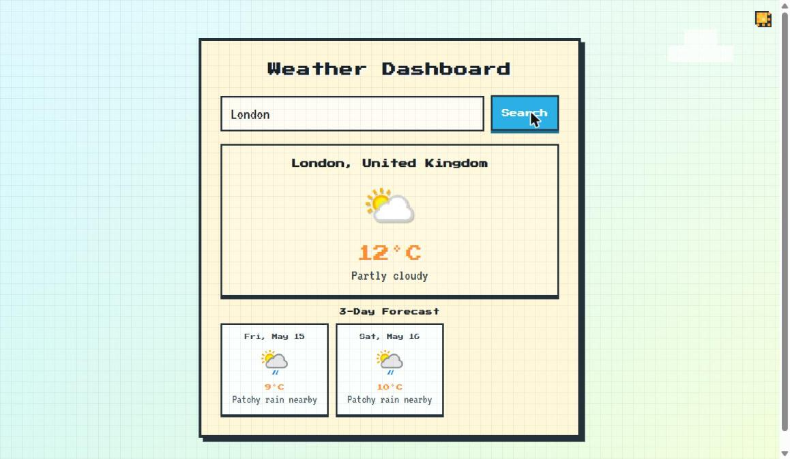
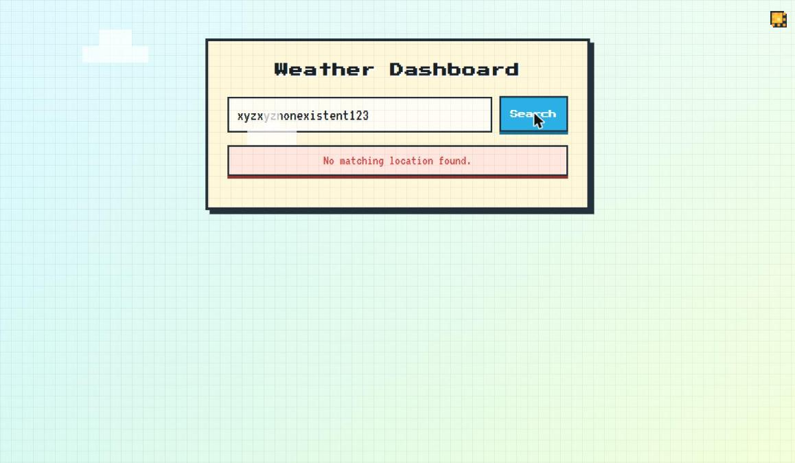
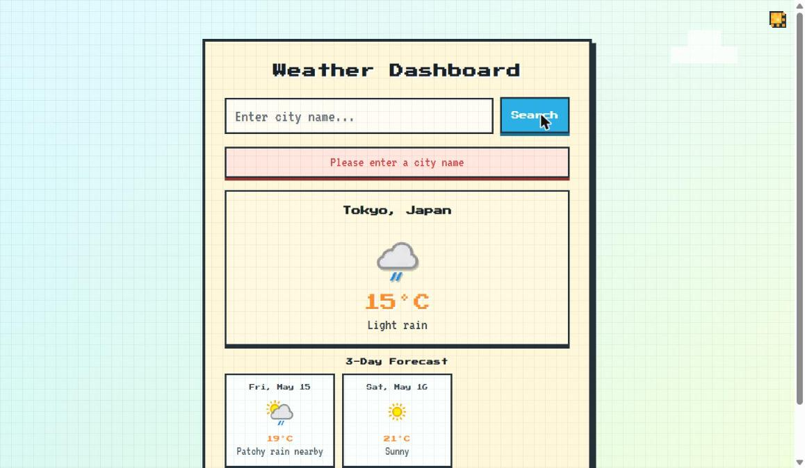
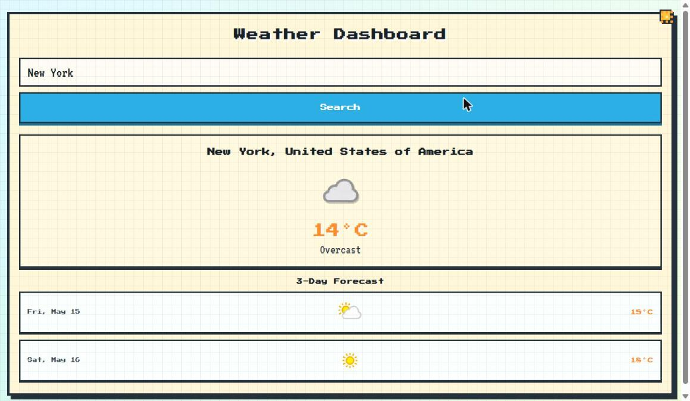

# 🌤️ Weather Dashboard App

A clean, responsive weather dashboard built with **HTML**, **CSS**, and **JavaScript** that pulls real-time weather data from the [WeatherAPI.com](https://www.weatherapi.com/) API. Users can search any city in the world and instantly see the current conditions plus a 3-day forecast.

> **Live Demo:** [oxheicodes.github.io/Weather-Dashboard-App](https://oxheicodes.github.io/Weather-Dashboard-App) *(if deployed)*

---

## 📸 Demo Walkthrough

### Screenshot Order (Recommended for Portfolio)

> **1 → 2 → 4 → 3 → 6 → 5**
> Landing Page → Weather Results → Multi-City Search → Error Handling → Validation → Mobile View

---

### 1. 🏠 Landing Page — Clean Initial State



**Feature shown:** App on first load — minimal, focused UI with a clear search prompt.

When the app loads for the first time it shows a clean search interface with no weather data. I kept the initial state uncluttered on purpose so the user knows exactly what to do. The animated pixel-art background and cloud element add personality without distracting from the main function.

**Why I built it this way:** I wanted the UI to feel inviting rather than empty. A good first impression matters, especially on a tool people will use casually.

**What I learned:** Thinking about the "empty state" of an app — not just the happy path — is something I didn't fully appreciate until I built this. It's a small thing that makes a big difference in how polished the app feels.

---

### 2. 🌆 Real-Time Weather Results — New York



**Feature shown:** Live weather data displayed after searching for "New York" — current temperature, weather condition, and weather icon pulled directly from WeatherAPI.com.

I used the `fetch()` API with `async/await` to make an asynchronous request to WeatherAPI's `/forecast.json` endpoint. Once the data comes back, I use DOM manipulation to inject the weather card into the page without any page reload. The temperature is rounded using `Math.round()` to keep the display clean.

**Why I built it this way:** Using `async/await` instead of `.then()/.catch()` chains made my code much easier to read and debug. It also helped me understand the request/response cycle more clearly.

**What I learned:** Working with a real external API taught me how to handle JSON responses, navigate nested data objects, and understand what HTTP status codes mean in practice — not just in theory.

---

### 3. 📅 3-Day Forecast — Multi-City Search (London)



**Feature shown:** The full forecast section showing the next 3 days of weather for London, UK — each card includes date, weather icon, average temperature, and condition description.

The forecast data comes from the same API call as the current weather (using `days=4` to get today + 3 days ahead). I use `.slice(1, 4)` to skip the current day and show only the upcoming 3 days. Each forecast card is generated using `.map()` over the forecast array and joined into a single HTML string, which is then injected via `innerHTML`.

**Why I built it this way:** I reused the same API call instead of making a second request just for the forecast. This keeps the app faster and reduces unnecessary API usage — which also matters since the free tier has request limits.

**What I learned:** I got a lot more comfortable with array methods like `.map()`, `.slice()`, and `.join()` for building dynamic HTML. It also helped me think about data structure — the API returns an array of forecast days, and knowing how to navigate that efficiently was a key skill I picked up.

---

### 4. ❌ Error Handling — Invalid City Name



**Feature shown:** When a user types a city that doesn't exist (e.g. "xyzxyznonexistent123"), the app displays a clear, styled error message — "No matching location found." — and clears any previous results.

I wrapped the `fetch` call in a `try/catch` block. If the API returns a non-ok HTTP status, I read the `error.message` from the JSON response body and throw it manually. The catch block then displays that message in the `#error` element which has a red styled box. I also call `clearResults()` first on every new search so stale data never appears alongside an error.

**Why I built it this way:** I didn't want the app to silently break or show old data when something goes wrong. Showing a clear message keeps the user informed and makes the app feel reliable.

**What I learned:** Error handling in async JavaScript was probably the hardest thing to wrap my head around at first. Learning that `fetch()` doesn't throw on 4xx/5xx errors — you have to manually check `response.ok` — was a real "aha" moment for me.

---

### 5. ⚠️ Input Validation — Empty Search



**Feature shown:** If the user clicks "Search" without typing anything, the app immediately shows a validation message — "Please enter a city name" — without making any API call.

Before making any network request, I check if the city input is empty using `.trim()`. If it is, I call `showError()` and return early to stop the function. This prevents unnecessary API calls and gives the user immediate feedback.

**Why I built it this way:** It's a small guard but it's good practice — you should never trust user input and should validate it as early as possible. It also saves API quota.

**What I learned:** Client-side validation before API calls is something I'll always include going forward. It's simple to implement but makes the app feel much more intentional and professional.

---

### 6. 📱 Responsive Design — Mobile Layout



**Feature shown:** On smaller screens, the layout adapts — the search button goes full-width below the input, the forecast cards stack vertically in a compact list view, and the condition text is hidden to save space.

I used a single CSS media query (`@media (max-width: 560px)`) to handle all mobile adjustments. The search box switches from `display: flex` (row) to `flex-direction: column`, and the forecast grid changes from `repeat(3, 1fr)` to `1fr`. The forecast cards also flip to a horizontal `flex` layout with the date on the left and temperature on the right for a more compact view.

**Why I built it this way:** I wanted the app to be usable on any device without a separate mobile stylesheet. CSS Grid and Flexbox made this much easier than I expected — one media query was enough to cover all the mobile changes.

**What I learned:** Responsive design is less about making things "fit" and more about rethinking the layout for the context. On mobile, you have less horizontal space but users still want all the core info — so I had to prioritize what to show and what to hide.

---

## 🛠️ Tech Stack

| Technology | Purpose |
|---|---|
| HTML5 | Page structure and semantic markup |
| CSS3 | Styling, layout (Flexbox + Grid), responsive design |
| JavaScript (ES6+) | DOM manipulation, async API calls, localStorage |
| WeatherAPI.com | Real-time weather and forecast data |

---

## ✨ Key Features

- 🔍 **City search** with input validation and keyboard support (Enter key)
- 🌡️ **Real-time weather** — temperature, condition, and weather icon
- 📅 **3-day forecast** — daily breakdown with icons and temperatures
- 💾 **Persistent last search** — uses `localStorage` to remember the last city on reload
- ❌ **Error handling** — clear messages for invalid cities and empty input
- 📱 **Responsive layout** — works on desktop, tablet, and mobile
- 🎨 **Pixel-art UI** — clean retro aesthetic with day/night mode detection

---

## 🚀 Getting Started

1. Clone the repo:
   ```bash
   git clone https://github.com/OxheiCodes/Weather-Dashboard-App.git
   ```
2. Open `index.html` in your browser, or use a local dev server like VS Code Live Server.
3. The app uses a bundled API key for demo purposes. To use your own, replace `API_KEY` in `script.js` with a key from [WeatherAPI.com](https://www.weatherapi.com/).

---

## 💡 Key Takeaways / What I Learned

Building this project taught me a lot more than I expected from a "simple" weather app:

**Working with external APIs** was the biggest learning curve. I had to understand how to read API documentation, construct a proper request URL with query parameters, and navigate the JSON response to find the data I needed. I also learned that `fetch()` doesn't automatically throw errors for bad status codes — you have to handle that yourself.

**Asynchronous JavaScript** became much clearer after this project. The flow of `async/await` with proper `try/catch/finally` blocks felt natural once I saw it working in a real app. The `finally` block for hiding the loading state was a nice moment where the concept really clicked.

**DOM manipulation without a framework** was a good challenge. Generating HTML strings with template literals and injecting them via `innerHTML` — while calling `clearResults()` first to prevent stale data — showed me how React and Vue solve real problems rather than just being buzzwords.

**localStorage for persistence** was a simple but satisfying feature to add. The app automatically searches the last city on reload, which makes it feel more polished and production-ready.

**Responsive CSS** using one media query and CSS Grid/Flexbox was cleaner than I expected. I learned to think about layout changes holistically rather than patching individual elements.

Overall this was a great project for getting comfortable with the full frontend loop: structure → styling → JavaScript logic → external data → user experience.

---

## 📁 Project Structure

```
Weather-Dashboard-App/
├── index.html          # Main HTML structure
├── style.css           # All styles including responsive design
├── script.js           # App logic, API calls, DOM updates
└── screenshots/        # Portfolio demo screenshots
```

---

*Built by [OxheiCodes](https://github.com/OxheiCodes) — Richard Okon*
